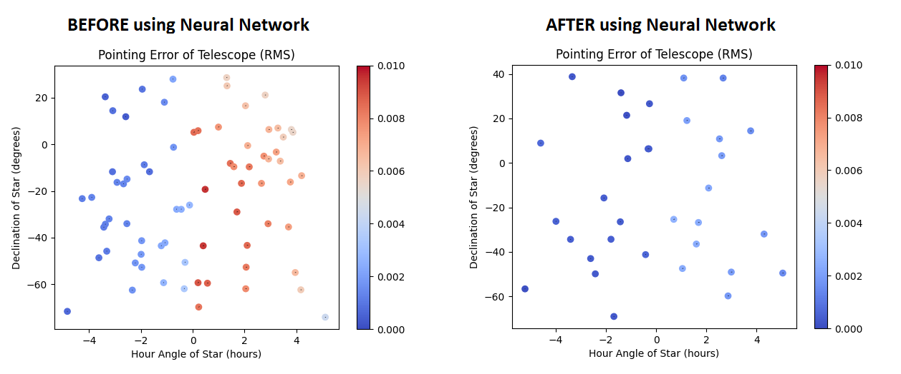

<h1 align="center">StarSeer</h1>
<h3 align="center">Using Machine Learning for minimizing mount telescope pointing errors.</h3>

<h3>Pointing</h3>

Is recomended to point to known star fields, center the star on the CCD/oculars and than register coordinates using <b>save_dataframe</b>. 60+ points is a good number of stars for a good model.

<h3>Case Study</h3>

Using a 0.4m Telescope with a Paramount ME mount at Pico dos Dias Observatory <b>(MPC 874)</b>

Accepts string formated inputs i.e. ha="02:45:43.23", and float ha=-4.23

<h3>Coordinates needed | CSV header</h3>

ah_star,dec_star,ah_scope,dec_scope,err_ah,err_dec,elevation,azimuth,temperature,prev_ha,prev_dec

## Prerequisites

* Python 3.9 is recommended

